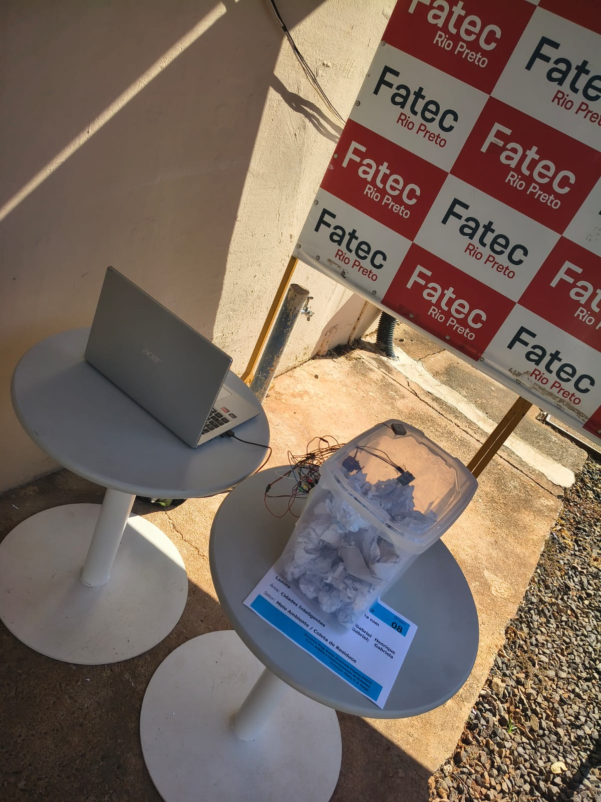
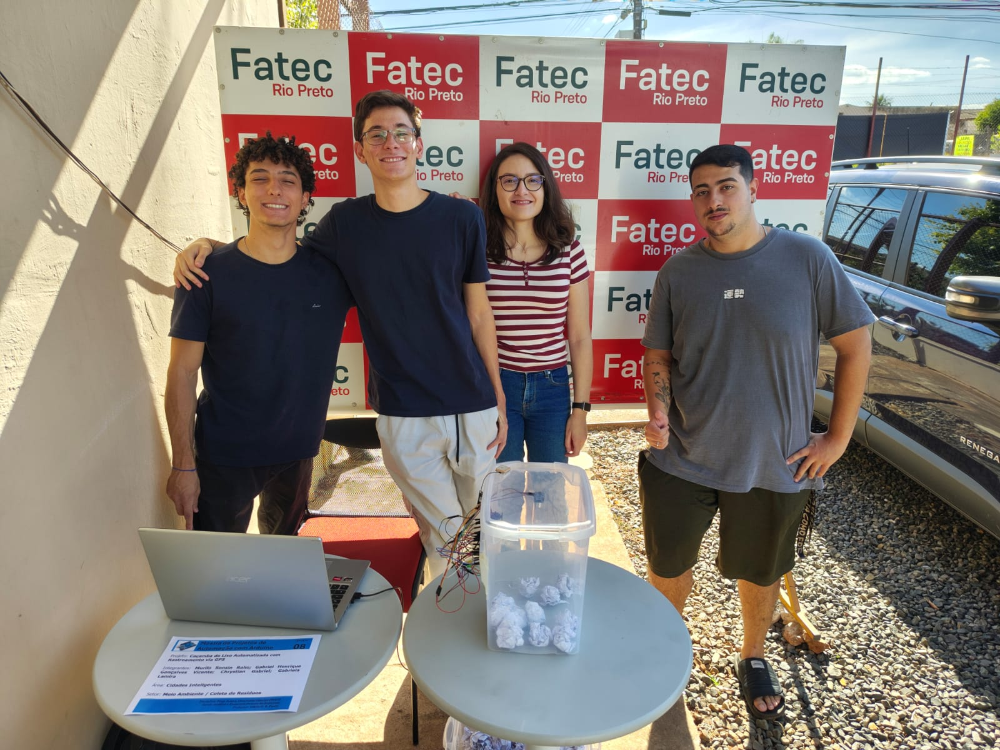

# 🗑️ Caçamba de Lixo Automatizada com ESP32

Projeto acadêmico desenvolvido utilizando ESP32 para monitoramento inteligente de resíduos urbanos por meio de tecnologias de Internet das Coisas (IoT).

O sistema monitora o nível de ocupação de uma caçamba utilizando sensores, obtém sua localização geográfica por GPS e disponibiliza informações que podem auxiliar na otimização dos serviços de coleta urbana.

> 📚 Projeto desenvolvido para a disciplina de Programação Avançada Orientada a Objeto (PAOO) da FATEC Rio Preto.
>
> 🚀 Projeto apresentado em uma mostra tecnológica da FATEC Rio Preto para professores, alunos e representantes de instituições públicas e privadas da região.

---

## 📖 Sobre o Projeto

A gestão de resíduos urbanos enfrenta desafios relacionados à falta de informações em tempo real sobre o estado das caçambas distribuídas pela cidade. Como consequência, algumas regiões podem apresentar acúmulo excessivo de lixo enquanto outras recebem coletas desnecessárias.

Com o objetivo de demonstrar uma aplicação prática de IoT para cidades inteligentes, foi desenvolvido um protótipo de uma caçamba automatizada capaz de monitorar seu nível de ocupação e fornecer dados relevantes para o planejamento da coleta.

---

## 🎯 Objetivos

- Monitorar o nível de ocupação da caçamba em tempo real;
- Identificar situações próximas da capacidade máxima;
- Informar a localização da lixeira através de GPS;
- Permitir interação remota via Bluetooth;
- Demonstrar a aplicação de tecnologias embarcadas em soluções para cidades inteligentes.

---

## 🛠️ Componentes Utilizados

| Componente | Quantidade |
|------------|------------|
| ESP32-WROOM-32 | 1 |
| GPS Mingwu NEO-6M GY-GPS6MV2 com antena | 1 |
| Sensor Ultrassônico HC-SR04 | 1 |
| Servo Motor | 1 |
| LEDs (Verde, Amarelo e Vermelho) | 3 |
| Protoboards | 2 |
| Jumpers | Aproximadamente 30 |

---

## ⚙️ Tecnologias Utilizadas

- C++
- Arduino IDE
- ESP32
- Bluetooth Serial
- TinyGPS++
- ESP32Servo

---

## 📂 Estrutura do Projeto

```text
.
├── images/
│   ├── prototipo.jpg
│   └── Equipe.jpg
├── lixeiraArduino.ino
└── README.md
```

---

## 🔍 Funcionamento

### Monitoramento do Nível de Ocupação

O sensor ultrassônico HC-SR04 realiza medições contínuas da distância entre a parte superior da caçamba e o lixo acumulado.

Com base nesses valores, o sistema calcula o percentual aproximado de ocupação da caçamba.

### Indicação Visual

O estado da caçamba é indicado através de LEDs:

| Nível de Ocupação | Indicação |
|-------------------|-----------|
| 0% a 59% | 🟢 Verde |
| 60% a 84% | 🟡 Amarelo |
| 85% a 100% | 🔴 Vermelho |

### Localização por GPS

O módulo GPS NEO-6M fornece as coordenadas geográficas da caçamba.

O sistema disponibiliza as seguintes informações:

- Latitude;
- Longitude;
- Percentual de ocupação.

Essas informações podem ser utilizadas por sistemas externos para auxiliar no planejamento e otimização das rotas de coleta.

### Comunicação Bluetooth

O ESP32 cria um dispositivo Bluetooth denominado:

```text
Lixeira_Smart
```

Por meio dele é possível enviar comandos para controlar a abertura e o fechamento da trava da caçamba.

| Comando | Ação |
|----------|--------|
| L | Fechar trava |
| U | Abrir trava |

### Controle da Trava

Um servo motor é utilizado para simular uma trava eletrônica da caçamba.

- 25° → Trava fechada
- 100° → Trava aberta

---

## 🚀 Como Executar

1. Instale a Arduino IDE.
2. Adicione o suporte para placas ESP32.
3. Instale as bibliotecas necessárias:
   - TinyGPS++
   - ESP32Servo
4. Monte o circuito utilizando os componentes descritos neste projeto.
5. Conecte a placa ESP32 ao computador.
6. Faça o upload do código para a placa.
7. Abra o Monitor Serial para acompanhar o funcionamento do sistema.

---

## 📊 Resultados Obtidos

O protótipo foi capaz de:

- Monitorar o nível de ocupação em tempo real;
- Indicar visualmente o estado da caçamba através de LEDs;
- Obter coordenadas geográficas utilizando GPS;
- Transmitir informações por Bluetooth;
- Demonstrar a viabilidade do uso de IoT na gestão inteligente de resíduos urbanos.

---

## 📸 Demonstração

### Protótipo apresentado



### Equipe durante a apresentação



---

## 🔮 Trabalhos Futuros

Como evolução do projeto, podem ser implementadas funcionalidades adicionais, tais como:

- Utilização da conexão Wi-Fi do ESP32 para envio dos dados a um servidor remoto;
- Monitoramento centralizado de múltiplas lixeiras em uma única plataforma;
- Sistema de notificações automáticas para equipes de coleta;
- Integração com sistemas de geolocalização e otimização de rotas;
- Alimentação por energia solar para maior autonomia em ambientes urbanos;
- Aprimoramento da estrutura física para utilização em ambientes externos.

---

## 👨‍💻 Equipe

Projeto desenvolvido por alunos da FATEC Rio Preto para a disciplina de Programação Avançada Orientada a Objeto (PAOO), com foco na aplicação de conceitos de IoT e sistemas embarcados para cidades inteligentes.

### Integrantes

- Murilo Sonsin Ralio — [Murilo Rálio](https://github.com/Murilo004)
- Gabriel Henrique Gonçalves Vicente — [Gabriel Vicente](https://github.com/gabrielvicente3425-droid)
- Christian Gabriel Alves Avelino
- Gabriela Altino Lamira

---

## 📄 Licença

Este projeto foi desenvolvido para fins acadêmicos e educacionais. O código-fonte está disponível para consulta e estudo.
